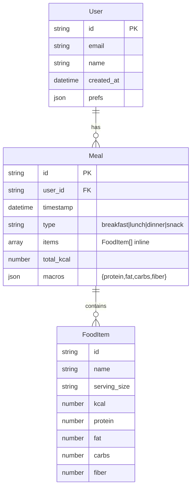

# Fitness App — ERD (Entity Relationship Diagram)

This document describes the core data model for v1: **User**, **Meal**, and **FoodItem**.

---

## 1) Overview

- One **User** has many **Meals**.  
- One **Meal** has many **FoodItems** (stored inline for v1 simplicity).  
- For v1 we keep a denormalized `macros` summary on **Meal** to speed up UI totals.

---

## 2) Entities (Tables)

### User
| Field       | Type          | Notes                             |
|-------------|---------------|-----------------------------------|
| id (PK)     | string (UUID) | Primary key                       |
| email       | string        | Unique, required                  |
| name        | string        | Optional                          |
| created_at  | datetime      | ISO 8601                          |
| prefs       | JSON          | e.g., units, display preferences  |

### Meal
| Field        | Type             | Notes                                  |
|--------------|------------------|----------------------------------------|
| id (PK)      | string (UUID)    | Primary key                            |
| user_id (FK) | string           | References **User.id**                 |
| timestamp    | datetime         | When the meal was eaten                |
| type         | enum             | "breakfast" \| "lunch" \| "dinner" \| "snack" |
| items        | FoodItem[] (arr) | Inline array of food items             |
| total_kcal   | number           | Derived (sum of items.kcal)            |
| macros       | JSON             | `{ protein, fat, carbs, fiber }` totals|

### FoodItem (inline object on Meal.items[])
| Field        | Type     | Notes                                |
|--------------|----------|--------------------------------------|
| id           | string   | Local id or external food DB id      |
| name         | string   | Item name                            |
| serving_size | string   | Human-readable (e.g., "100 g")       |
| kcal         | number   | Per serving                          |
| protein      | number   | g                                    |
| fat          | number   | g                                    |
| carbs        | number   | g                                    |
| fiber        | number   | g                                    |

---

## 3) Relationships & Cardinality

- **User (1) ──< Meal (many)**
- **Meal (1) ──< FoodItem (many)** (embedded for v1; can be normalized later)

Business rules:
- A Meal **must** belong to exactly one User (`Meal.user_id` required).
- A FoodItem **must** belong to exactly one Meal (embedded in `Meal.items[]`).
- `Meal.total_kcal` and `Meal.macros` should match the sum of `items`.

---

## 4) ASCII Diagram (always renders)

+-----------+ +-----------+

User	1 n	Meal
id (PK)		id (PK)
email		user_idFK
name		timestamp
created_at		type
prefs JSON		items[]
+-----------+	totals
                    +-----------+
                           |
                           | 1      n  (embedded array)
                           v
                    +----------------+
                    |   FoodItem     |
                    | (inline on     |
                    |  Meal.items[]) |
                    +----------------+

---

## 5) Mermaid Diagram (renders in many tools)

> If your Markdown viewer supports Mermaid, this will show as a diagram.

---

## 6) v1.1 Extensions (Onboarding, Plans, PT)

### Profile (1:1 with User)
| Field           | Type    | Notes                                                |
|-----------------|---------|------------------------------------------------------|
| user_id (PK/FK) | string  | References **User.id**                               |
| sex             | enum    | `male`|`female`|`other`|`prefer_not_to_say`         |
| height_cm       | number  | Optional                                             |
| weight_kg       | number  | Optional                                             |
| dob             | date    | `YYYY-MM-DD`, optional                               |
| activity_level  | enum    | `sedentary`|`light`|`moderate`|`active`|`athlete`   |
| equipment       | string[]| E.g., `dumbbells`, `bands`, `gym`                    |
| schedule_days   | enum[]  | Days of week (`Mon`..`Sun`)                          |

### Goals (1:1 with User)
| Field              | Type   | Notes                                                       |
|--------------------|--------|-------------------------------------------------------------|
| user_id (PK/FK)    | string | References **User.id**                                      |
| primary            | enum   | `fat_loss`|`muscle_gain`|`recomp`|`performance`|`rehab`     |
| target_weight_kg   | number | Optional                                                     |
| protein_target_g   | number | Optional (can be derived)                                   |
| daily_kcal_target  | number | Optional (can be derived)                                   |
| notes              | string | Optional                                                     |

### Injuries (1:n entries per User)
| Field            | Type          | Notes                                                                  |
|------------------|---------------|------------------------------------------------------------------------|
| user_id (PK/FK)  | string        | References **User.id**                                                 |
| entries          | InjuryEntry[] | `{ id, area, onset_date, severity_baseline, red_flags[], notes }`      |

### WorkoutPlan (n per User)
| Field             | Type     | Notes                                                                     |
|-------------------|----------|---------------------------------------------------------------------------|
| id (PK)           | string   | UUID                                                                      |
| user_id (FK)      | string   | References **User.id**                                                    |
| start_date        | date     | `YYYY-MM-DD`                                                               |
| weeks             | number   | Program length                                                            |
| split             | string[] | E.g., `Upper/Lower`, `Full body x3`                                       |
| sessions          | JSON     | `{ day, exercises[{ name, sets, reps, rir?, tempo?, notes? }] }[]`        |
| progression_rules | JSON     | `{ apply_if_completion_pct, rir_target_max, increment_* }`                |

### PTPlan (n per User)
| Field                | Type   | Notes                                                                   |
|----------------------|--------|-------------------------------------------------------------------------|
| id (PK)              | string | UUID                                                                    |
| user_id (FK)         | string | References **User.id**                                                  |
| area                 | string | Affected body area                                                       |
| phase                | enum   | `calm`|`restore`|`build`                                                |
| frequency_per_week   | number | Sessions per week                                                        |
| exercises            | JSON   | `{ name, sets, reps?, tempo_or_hold_seconds?, notes?, stop_if? }[]`      |
| pain_guardrails      | JSON   | `{ max_pain_allowed, trend_required }`                                  |
| reassess_after_days  | number | When to prompt reassessment                                              |

### Extended Relationships & Rules
- **User (1) ──  (1) Profile**
- **User (1) ──  (1) Goals**
- **User (1) ──< (n) Injuries.entries**
- **User (1) ──< (n) WorkoutPlan**
- **User (1) ──< (n) PTPlan**

Derived & validations:
- Meal totals/macros = sum of items (validate on write).
- Daily totals = sum of a day’s meals (cache for performance).
- Workout progression applies if completion ≥ threshold and RIR ≤ target.
- PT phases advance only if pain trend stable/improving within guardrails.
- Timestamps ISO 8601; numeric fields non-negative; pain scale 0–10.

Indexes:
- `User.email` (unique)
- `Meal(user_id, timestamp)`
- `WorkoutPlan(user_id, start_date)`
- `PTPlan(user_id, area)`
